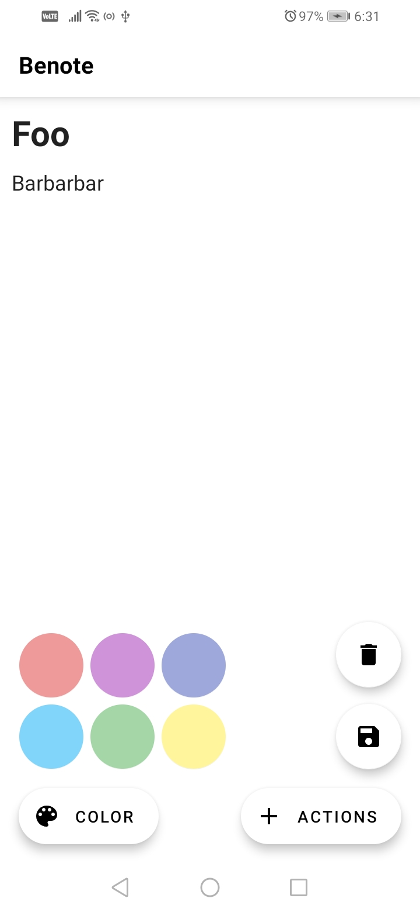
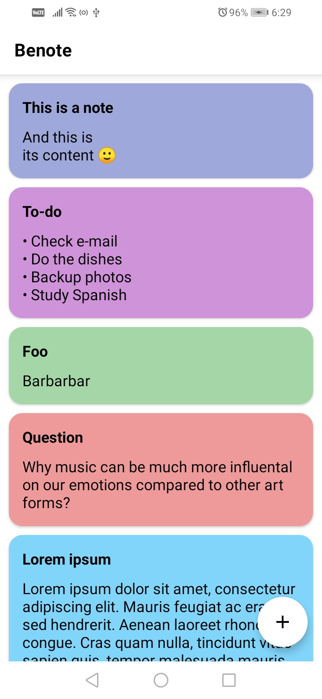
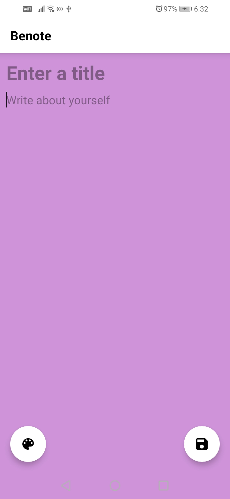

# Benote

Welcome to Benote, an elegant notetaking app designed for Android users. With its sleek UI and soothing pastel colors, Benote offers a delightful notetaking experience. You can easily [download the app here](https://github.com/dybdeskarphet/benote/releases/download/1.1/app-debug.apk).

## Screenshots

  

## Features

- **User-Friendly Interface**: Benote provides a clean and intuitive UI for a seamless notetaking experience.
  
- **Pastel Colors**: Enjoy a visually pleasing atmosphere with pastel colors that enhance readability and reduce eye strain.

- **Effortless Editing**: Edit your notes with ease using the simple and efficient editing features.

- **Organized Note List**: Easily navigate through your notes with a well-organized note list, ensuring you find what you need quickly.

## Installation Guide

1. Download the APK file from the [release page](https://github.com/dybdeskarphet/benote/releases/download/1.1/app-debug.apk).
2. Enable installation from unknown sources in your device settings.
3. Install Benote by opening the downloaded APK file.

## How to Contribute

We welcome contributions to make Benote even better. If you have suggestions, bug reports, or want to contribute code, feel free to [create an issue](https://github.com/dybdeskarphet/benote/issues) or submit a pull request.
